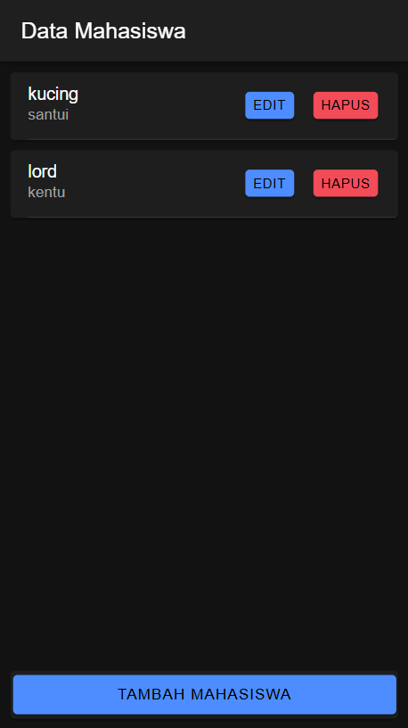
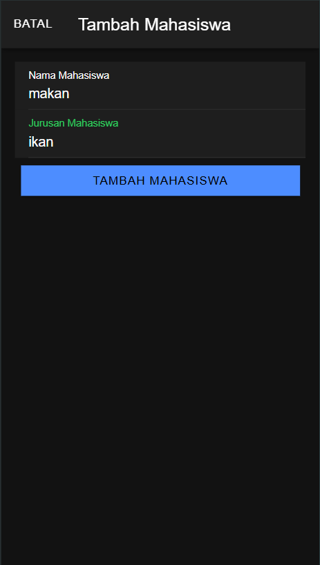
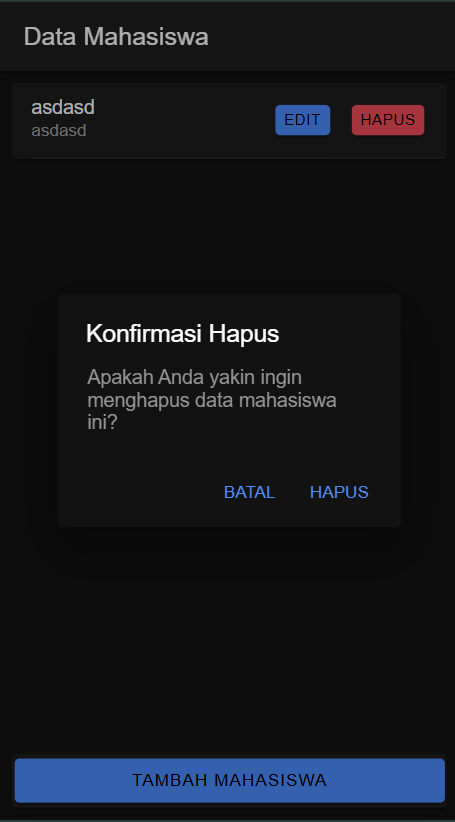

# Penjelasan

## 1. Setup Awal

### Konfigurasi `AppModule`
Agar aplikasi dapat berinteraksi dengan API, deklarasikan `provideHttpClient` di dalam `app.module.ts`:

```typescript
import { NgModule } from '@angular/core';
import { BrowserModule } from '@angular/platform-browser';
import { RouteReuseStrategy } from '@angular/router';

import { IonicModule, IonicRouteStrategy } from '@ionic/angular';
import { AppComponent } from './app.component';
import { AppRoutingModule } from './app-routing.module';
import { provideHttpClient } from '@angular/common/http';

@NgModule({
  declarations: [AppComponent],
  imports: [BrowserModule, IonicModule.forRoot(), AppRoutingModule],
  providers: [{ provide: RouteReuseStrategy, useClass: IonicRouteStrategy }, provideHttpClient()],
  bootstrap: [AppComponent],
})
export class AppModule { }
```

### Konfigurasi `ApiService`
Di dalam `service/api.service.ts`, tambahkan fungsi CRUD yang akan berkomunikasi dengan API:

```typescript
import { Injectable } from '@angular/core';
import { HttpClient } from '@angular/common/http';
import { Observable } from 'rxjs';

@Injectable({
  providedIn: 'root'
})
export class ApiService {
  constructor(private http: HttpClient) { }
  
  apiURL() { return 'http://localhost/mahasiswa'; }

  tambah(data: any, endpoint: string) { return this.http.post(this.apiURL() + '/' + endpoint, data); }
  edit(data: any, endpoint: string) { return this.http.put(this.apiURL() + '/' + endpoint, data); }
  tampil(endpoint: string): Observable<any> { return this.http.get(this.apiURL() + '/' + endpoint); }
  hapus(id: any, endpoint: string) { return this.http.delete(this.apiURL() + '/' + endpoint + '' + id); }
  lihat(id: any, endpoint: string) { return this.http.get(this.apiURL() + '/' + endpoint + '' + id); }
}
```

## 2. Implementasi Fitur CRUD

### 2.1. Tampil Data

1. Deklarasikan `ApiService` dan buat fungsi `getMahasiswa()` di dalam `mahasiswa/mahasiswa.page.ts` untuk menampilkan data dari API.
2. Dalam `mahasiswa.page.html`, tampilkan data dengan menggunakan `*ngFor`.

```typescript
getMahasiswa() {
  this.api.tampil('tampil.php').subscribe({
    next: (res: any) => {
      this.dataMahasiswa = res;
    },
    error: (err: any) => { console.log(err); },
  });
}
```

### 2.2. Tambah Data

1. Tambahkan `ModalController` untuk membuka modal penambahan data.
2. Buat fungsi `tambahMahasiswa()` untuk mengirim data ke API.

```typescript
tambahMahasiswa() {
  if (this.nama && this.jurusan) {
    let data = { nama: this.nama, jurusan: this.jurusan };
    this.api.tambah(data, 'tambah.php').subscribe({
      next: () => {
        this.getMahasiswa();
        this.modal.dismiss();
      },
      error: () => { console.log('Gagal menambah data'); }
    });
  }
}
```

3. Di dalam `mahasiswa.page.html`, tambahkan tombol untuk membuka modal penambahan.

### 2.3. Hapus Data

1. Buat fungsi `hapusMahasiswa()` untuk menghapus data dari API.

```typescript
hapusMahasiswa(id: any) {
  this.api.hapus(id, 'hapus.php?id=').subscribe({
    next: () => { this.getMahasiswa(); },
    error: () => { console.log('Gagal menghapus data'); }
  });
}
```

2. Buat fungsi `confirmhapusMahasiswa()`untuk alertnya
```typescript
async confirmHapusMahasiswa(id: any) {
    const alert = await this.alertCtrl.create({
      header: 'Konfirmasi Hapus',
      message: 'Apakah Anda yakin ingin menghapus data mahasiswa ini?',
      buttons: [
        {
          text: 'Batal',
          role: 'cancel',
          handler: () => {
            console.log('Hapus dibatalkan');
          },
        },
        {
          text: 'Hapus',
          handler: () => {
            this.hapusMahasiswa(id);
          },
        },
      ],
    });

    await alert.present();
  }
```

2. Tambahkan tombol hapus pada tiap item data di `mahasiswa.page.html`.

### 2.4. Edit Data

1. Buat fungsi `ambilMahasiswa()` untuk mengambil data spesifik berdasarkan `id` dan mengisi modal edit.
2. Buat fungsi `editMahasiswa()` untuk memperbarui data.

```typescript
editMahasiswa() {
  let data = { id: this.id, nama: this.nama, jurusan: this.jurusan };
  this.api.edit(data, 'edit.php').subscribe({
    next: () => {
      this.getMahasiswa();
      this.modal.dismiss();
    },
    error: () => { console.log('Gagal memperbarui data'); }
  });
}
```

3. Di `mahasiswa.page.html`, tambahkan tombol dan modal edit data untuk setiap item.

---
